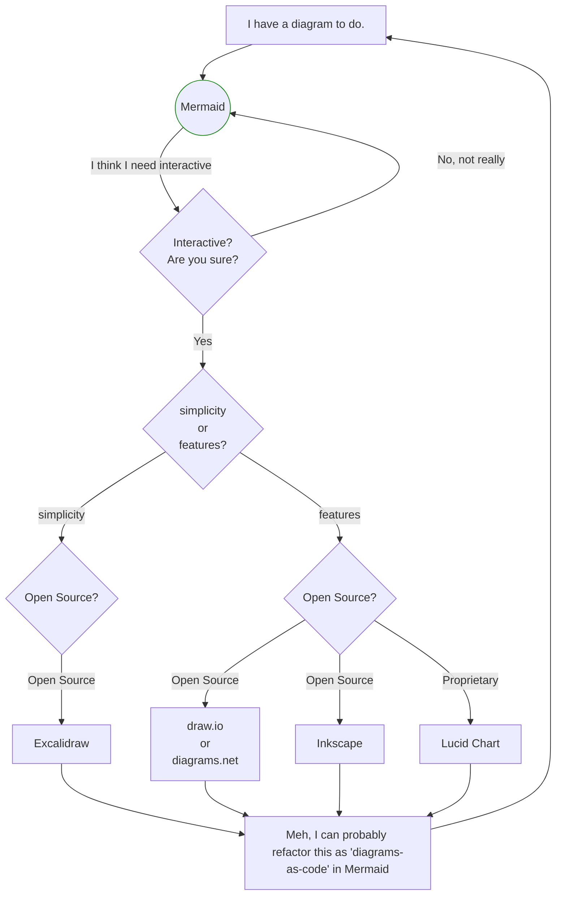

## Markup tools

### Mermaid

Great for less complicated layouts, but can be used with patience for more complex stuff.
Not necessarily a downside, doing complex stuff in an interactive editor is also complicated, but perhaps differently.
Simon's use case, for example, is a simple application for which Mermaid does a perfect job.
You can do more complex layouts as in the Kubewarden and Epinio diagrams,
but small changes in markup can result in big changes in output appearance as the
automated layout algorithm reworks paths from scratch again.
Lots of grouping using `subgraph` is useful here.
Mermaid's big advantage is that it's well integrated with Docusaurus.
Also, easy to use with VScode extensions.
Mermaid has an active community.
GitHub renders Mermaid diagrams in Markdown, which is convenient.

### PlantUML

In practice, it's quite similar to using Mermaid.
Different syntax and capabilities but they felt similar to use.

### Diagrams/Mingrammer

Again, a very similar way oof working to the previous two.

### D2

Didn't get round to this one, but again. Similar.

### Structurizr

For C4 and I didn't get round to this.
C4 architectural diagramming felt like it might be a bit high level for the use cases in consideration here.

## Interactive tools

### Excalidraw

Seemed to be very intuitive and easy to use.
Less features than Inkscape but more than enough for doing architecture diagrams.
Easy grouping, ungrouping and object moving.
Saves in Excalidraw/JSON format, but can export SVG.
Also, exports PNG for display.
The SVG is rendered by browsers but doesn't look as good as exporting PNG, for display, from Excalidraw.
If being used for production I'd recommend saving in Excalidraw/JSON and exporting PNG for display.

### Inkscape

Obviously, a comprehensive tool for graphic designers.
There is plenty to learn before becoming proficient.
For graphics from the ground up with full control over many features.

### Lucid

Comprehensive features, reasonably easy to use. Proprietary. SUSE has a license arrangement. Do we need the power and features? I'm not sure.

## Generally, ...

Hmmm....... I'm going to let this brew for a little while.

## TL;DR

- Use Mermaid as a first choice.
- If interactivity is wanted (are you sure) or needed:
  - Use Excalidraw for simplicity
  - Use draw.io, Inkscape, or Lucid for features and power.

<figure>

<figcaption>Graphical conclusion</figcaption>
</figure>