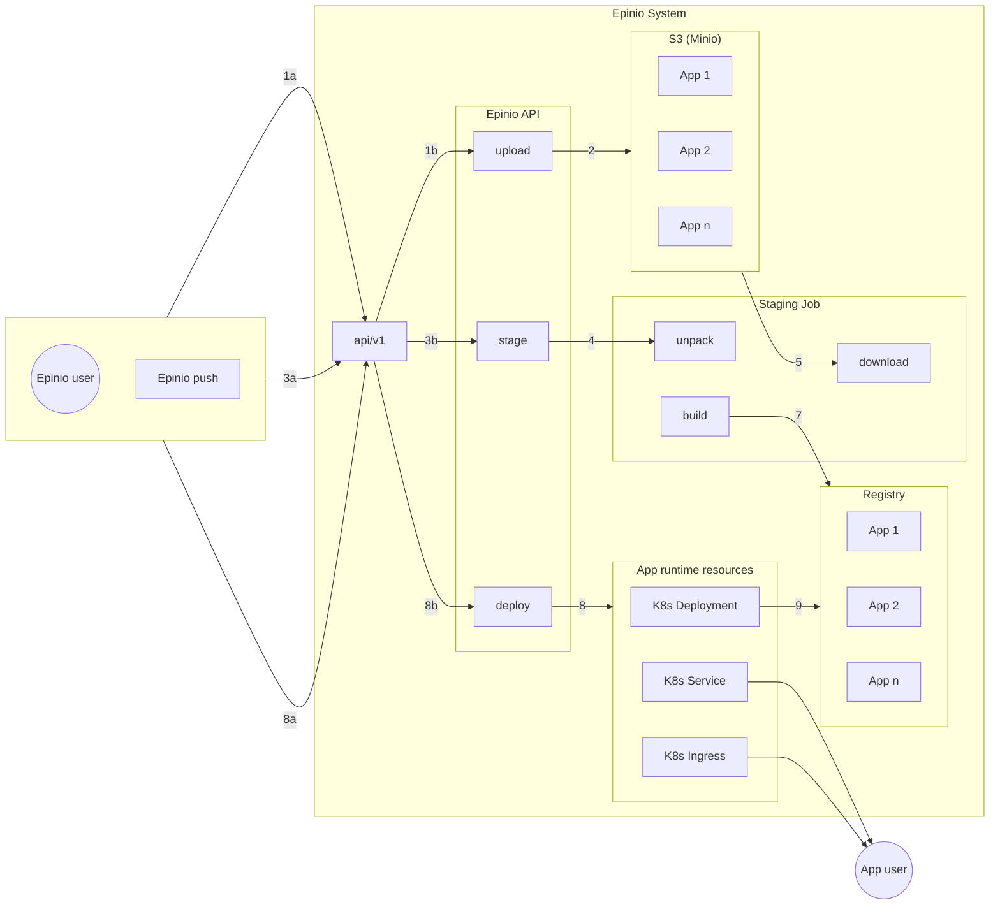
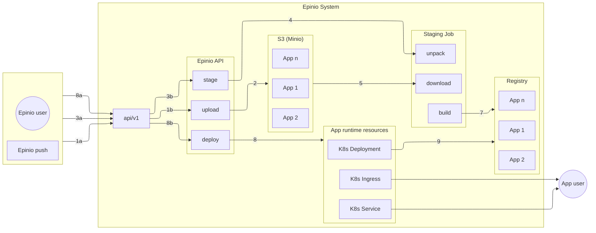

This diagram is part of the description of the [Epinio push process](https://docs.epinio.io/explanations/detailed-push-process).

<figure>

<figcaption>Epinio push diagram</figcaption>
</figure>

## Epinio with Excalidraw

Nice enough graphical editor to use.
Certainly, it felt easier to get going with than Inkscape.
A much simpler interface.
It won't have the graphical power and features of Inkscape, but that's not necessary for the architectural diagrams use case we're considering.

Excalidraw saves files in its own format, which is JSON based, so amenable to version control management.

It was easy to re-create the Epinio diagram in Excalidraw, it took a couple of hours with no prior experience of the tool.
The exported result in SVG and PNG and displayed below.
The PNG looks more like the editor version than the SVG.
Notice the use of icons imported from Kubernetes and other libraries.
There is also a variant in Excalidraw's handwritten/drawn style.
Which I sort of like, but am not sure about its use in technical documentation.

<figure>

<figcaption>The Excalidraw SVG</figcaption>
</figure>

<figure>

<figcaption>The Excalidraw PNG</figcaption>
</figure>

<figure>

<figcaption>The Excalidraw hand drawn PNG</figcaption>
</figure>

<figure>

<figcaption>The Epinio push process - Mermaid C4 - `dagre` layout</figcaption>
</figure>

<figure>

<figcaption>The Epinio push process - Mermaid C4 - `elk` layout</figcaption>
</figure>

## Lucid Chart

<figure>

<figcaption>Epinio push process in Lucid exported as SVG</figcaption>
</figure>