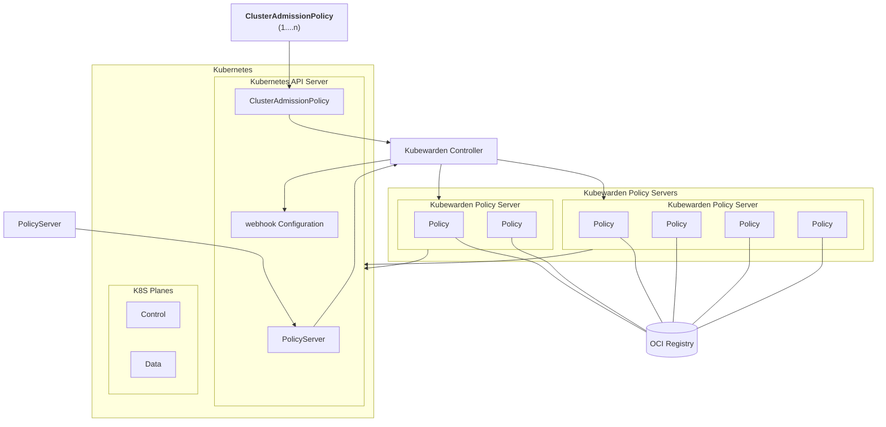
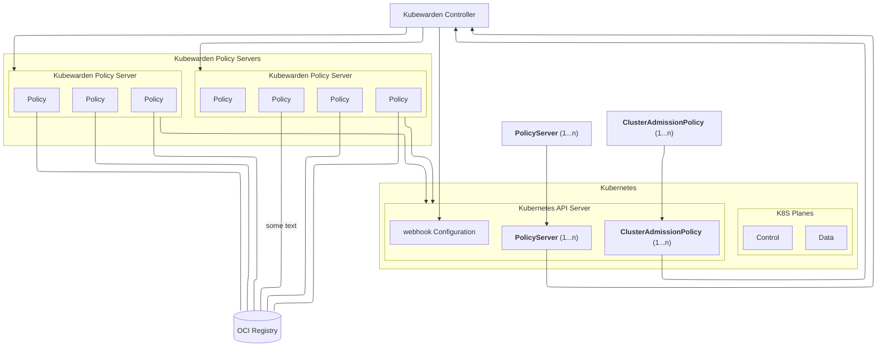

This diagram is part of the [Kubewarden architecture](https://docs.kubewarden.io/architecture) description.

This is the original diagram from that documentation.

<figure>

<figcaption>Original Kubewarden architecture diagram</figcaption>
</figure>

## Inkscape

This is the result of my first hour with Inkscape.
It appears Inkscape is a comprehensive graphical drawing tool.
So, you need to be familiar with the concepts of layers and transparency and all the other concepts related to this type of tool.
I dived in and tried to do an architecture block diagram.
It was difficult going.
I did start making progress, managing to get text and rectangles on the screen and group them together into objects.
I had particular difficulties in having text appear on the screen.
There is a long, comprehensive list of fonts but only those installed on your system are displayable.
Which was disconcerting, 'why is the text I typed in invisible?'.
Why not display only those that are going to be useable.

<figure>

<figcaption>Kubewarden architecture</figcaption>
</figure>

To continue there needs to be a period of time spent learning Inkscape and its working methodology.

## With Mermaid, `dagre` layout

<figure>

<figcaption>Mermaid, `dagre` layout</figcaption>
</figure>

## With Mermaid, `elk` layout

<figure>

<figcaption>Mermaid, `elk` layout</figcaption>
</figure>

## Excalidraw import of Mermaid markup

You can import Mermaid markup into Excalidraw.
But, impossible to export from Excalidraw to Mermaid markup.
Which is understandable but means the facility has limited use.
You would want to change permanently from a Mermaid markup diagram to Excalidraw.

Saved from Excalidraw in exported SVG and PNG.

<figure>

<figcaption>Excalidraw rendering of an imported Mermaid KW diagram</figcaption>
</figure>

The same but exported as a PNG.
It's a better preservation of Excalidraw's default hand drawn and written style.

<figure>

<figcaption>Excalidraw rendering of an imported Mermaid KW diagram, but exported as a PNG</figcaption>
</figure>

## Excalidraw drawings

I replicated the Kubewarden architecture diagram in Excalidraw, saved in Excalidraw/JSON format.
There are two versions, one appearing somewhat hand drawn the other more traditional.
They are versioned in git. [This](kubewarden-arch-hand.excalidraw.json) is the hand drawn version Excalidraw/JSON format file with a file extension of json, it should be viewable in your browser.

The next two figures are the exported PNG versions.

<figure>

<figcaption>Excalidraw hand drawn PNG of Kubewarden architecture</figcaption>
</figure>

<figure>

<figcaption>Excalidraw traditional PNG of Kubewarden architecture</figcaption>
</figure>