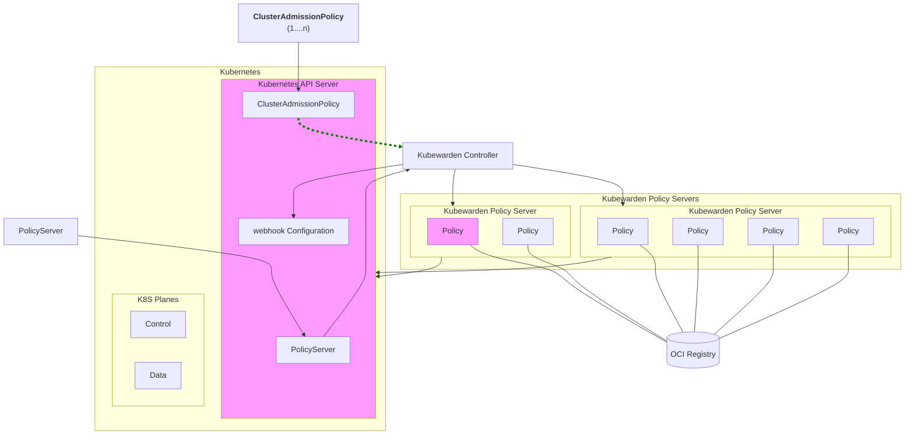
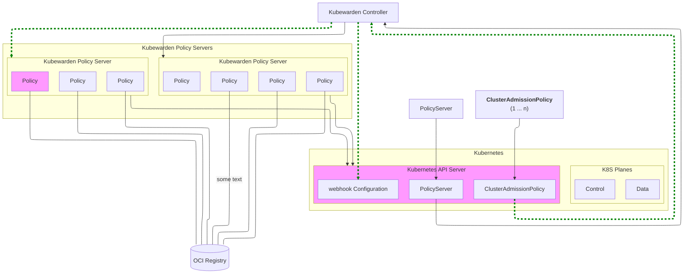

This diagram is part of the [Kubewarden architecture](https://docs.kubewarden.io/architecture) description.

## With Mermaid (dagre)

```mermaid
%%{init: {"flowchart": {"htmlLabels": false}} }%%
graph TB
    kubewarden_controller[Kubewarden Controller]
    subgraph k8s[Kubernetes]
      subgraph kubernetes_api_server[Kubernetes API Server]
          policy_server_in[PolicyServer]
          cluster_admission_policy_in[ClusterAdmissionPolicy]
          webhook_configuration[webhook Configuration]
      end
      subgraph planes[K8S Planes]
      k8s_control_plane[Control]
      k8s_data_plane[Data]
      end
    end
    policy_server_out[PolicyServer]
    cluster_admission_policy_out["`**ClusterAdmissionPolicy**<br/>(1....n)`"]
    cluster_admission_policy_in[ClusterAdmissionPolicy]
    kubewarden_policy_server_1[Kubewarden Policy Server]
    kubewarden_policy_server_2[Kubewarden Policy Server]
    oci_registry[(OCI Registry)]
    policy_server_out --> policy_server_in
    cluster_admission_policy_out --> cluster_admission_policy_in
    policy_server_in --> kubewarden_controller
    cluster_admission_policy_in --> kubewarden_controller
    kubewarden_controller --> webhook_configuration
    kubewarden_controller --> kubewarden_policy_server_1
    kubewarden_controller --> kubewarden_policy_server_2
    subgraph kwps [Kubewarden Policy Servers]
      subgraph kubewarden_policy_server_1[Kubewarden Policy Server]
          direction LR
          policy_1[Policy]
          policy_2[Policy]
      end
      subgraph kubewarden_policy_server_2[Kubewarden Policy Server]
          direction LR
          policy_3[Policy]
          policy_4[Policy]
          policy_5[Policy]
          policy_6[Policy]
      end
    end
    policy_1 --- oci_registry
    policy_2 --- oci_registry
    policy_3 --- oci_registry
    policy_4 --- oci_registry
    policy_5 --- oci_registry
    policy_6 --- oci_registry
    kubewarden_policy_server_1 --> kubernetes_api_server
    kubewarden_policy_server_2 --> kubernetes_api_server
    style policy_1 fill:#f9f
    style kubernetes_api_server fill:#f9f
    linkStyle 3 stroke:green,stroke-width:4px,stroke-dasharray: 5 5
```

## With Mermaid (elk)

```mermaid
%%{
  init: {
    "flowchart": {
      "htmlLabels": false,
      "defaultRenderer": "elk"
    }
  }
}%%
graph TB
    kubewarden_controller[Kubewarden Controller]
    subgraph k8s[Kubernetes]
      subgraph kubernetes_api_server[Kubernetes API Server]
          policy_server_in[PolicyServer]
          cluster_admission_policy_in[ClusterAdmissionPolicy]
          webhook_configuration[webhook Configuration]
      end
      subgraph planes[K8S Planes]
      k8s_control_plane[Control]
      k8s_data_plane[Data]
      end
    end
    policy_server_out[PolicyServer]
    cluster_admission_policy_out["`**ClusterAdmissionPolicy**<br/>(1 ... n)`"]
    cluster_admission_policy_in[ClusterAdmissionPolicy]
    kubewarden_policy_server_1[Kubewarden Policy Server]
    kubewarden_policy_server_2[Kubewarden Policy Server]
    oci_registry[(OCI Registry)]
    policy_server_out --> policy_server_in
    cluster_admission_policy_out --> cluster_admission_policy_in
    policy_server_in --> kubewarden_controller
    cluster_admission_policy_in --> kubewarden_controller
    kubewarden_controller --> webhook_configuration
    kubewarden_controller --> kubewarden_policy_server_1
    kubewarden_controller --> kubewarden_policy_server_2
    subgraph kwps [Kubewarden Policy Servers]
      subgraph kubewarden_policy_server_1[Kubewarden Policy Server]
          direction LR
          policy_1[Policy]
          policy_2[Policy]
          policy_3[Policy]
      end
      subgraph kubewarden_policy_server_2[Kubewarden Policy Server]
          direction LR
          policy_4[Policy]
          policy_5[Policy]
          policy_6[Policy]
          policy_7[Policy]
      end
    end
    policy_1 --- oci_registry
    policy_2 --- oci_registry
    policy_3 --- oci_registry
    policy_4 --- oci_registry
    policy_5 --- oci_registry
    policy_6 ---|some text| oci_registry
    kubewarden_policy_server_1 --> kubernetes_api_server
    kubewarden_policy_server_2 --> kubernetes_api_server
    style policy_1 fill:#f9f
    style kubernetes_api_server fill:#f9f
    linkStyle 3,4,5 stroke:green,stroke-width:4px,stroke-dasharray: 5 5
```
