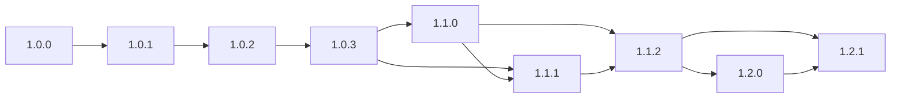
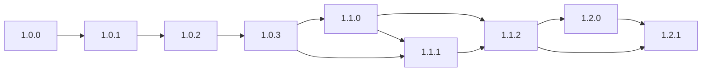
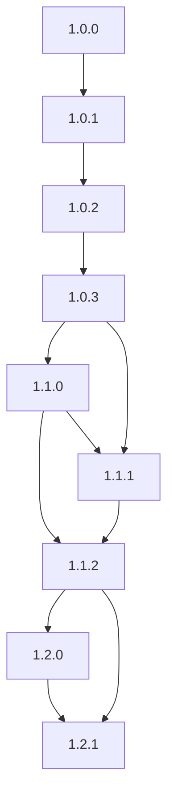
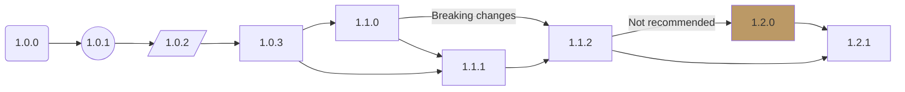
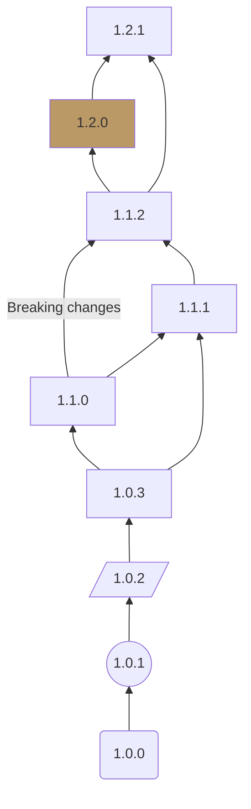
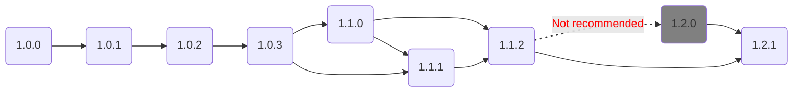
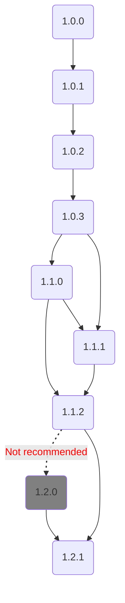

import Tabs from '@theme/Tabs';
import TabItem from '@theme/TabItem';

Simon Flood at Securelinx suggested a use case as follows;
A visual representation of the valid upgrade paths available
for [Harvester](https://docs.harvesterhci.io/v1.2/upgrade/index).

```console
graph LR;
    1.0.0-->1.0.1;
    1.0.1-->1.0.2;
    1.0.2-->1.0.3;
    1.0.3-->1.1.0;
    1.0.3-->1.1.1;
    1.1.0-->1.1.1;
    1.1.0-->1.1.2;
    1.1.1-->1.1.2;
    1.1.2-->1.2.0;
    1.1.2-->1.2.1;
    1.2.0-->1.2.1;
```

## The first iteration



Swapping the `1.1.0` lines to avoid path overlapping.



## Top to bottom orientation

It would be nice to swap to this if on a phone screen. Option
via tabs perhaps. But only for the diagram switch. I'm not a fan of tabs if
they hide searchable content.

<Tabs>
<TabItem value="Horizontal LR" label="Horizontal LR" default>


</TabItem>
<TabItem value="Vertical TB" label="Vertical TB">



</TabItem>
</Tabs>

## Some twiddling of options

Playing with shapes, etc. It needs the neutral theme to avoid the link text line running through the link text.

<Tabs>
  <TabItem value="Horizontal LR" label="Horizontal LR" default>



</TabItem>
<TabItem value="Vertical TB" label="Vertical TB">



</TabItem>
</Tabs>

A final version for this application:

<Tabs>

<TabItem value="Horizontal" label="Horizontal" default>



</TabItem>

<TabItem value="Vertical" label="Vertical" default>



</TabItem>

</Tabs>

## Observation

A good use of Mermaid in our documentation.
