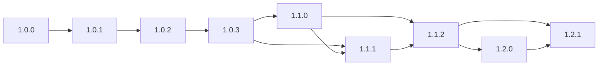
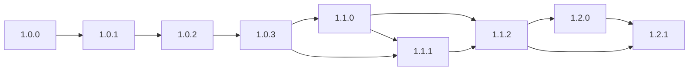
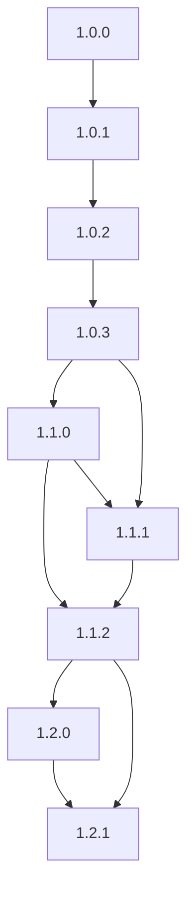
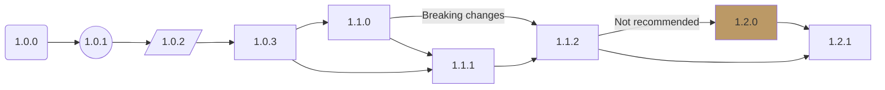
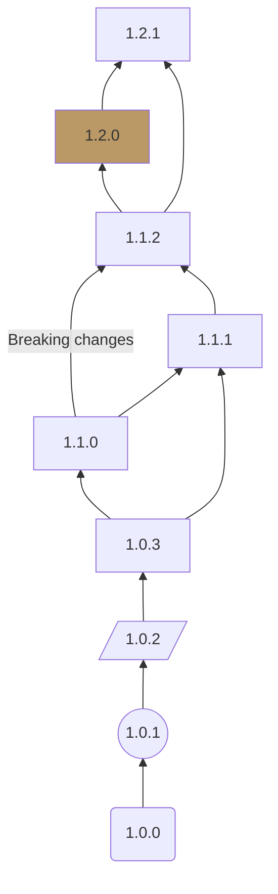
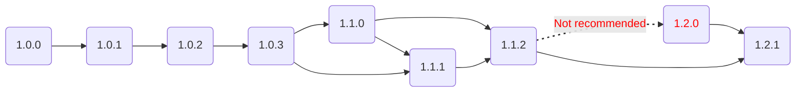
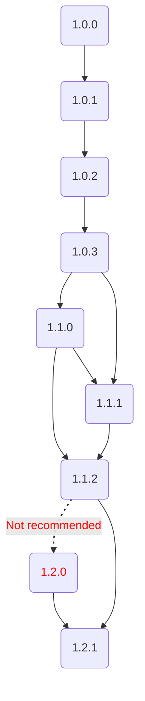

import Tabs from '@theme/Tabs';
import TabItem from '@theme/TabItem';

Simon Flood at Securelinx suggested a use case as follows;
A visual representation of the valid upgrade paths available
for [Harvester](https://docs.harvesterhci.io/v1.2/upgrade/index).

## Mermaid

```console
graph LR;
    1.0.0-->1.0.1;
    1.0.1-->1.0.2;
    1.0.2-->1.0.3;
    1.0.3-->1.1.0;
    1.0.3-->1.1.1;
    1.1.0-->1.1.1;
    1.1.0-->1.1.2;
    1.1.1-->1.1.2;
    1.1.2-->1.2.0;
    1.1.2-->1.2.1;
    1.2.0-->1.2.1;
```

### The first iteration{#first-attempt}

<figure>

<figcaption>The first attempt - Harvester upgrade paths </figcaption>
</figure>

Swapping the `1.1.0` lines to avoid path overlapping.

<figure>

<figcaption>With no crossing links</figcaption>
</figure>

### Top to bottom orientation

It would be nice to swap to this if on a phone screen.
Option via tabs perhaps.
But only for the diagram switch.
I'm not a fan of tabs if they hide searchable content.

<figure>
<Tabs>
<TabItem value="Horizontal LR" label="Horizontal LR" default>


</TabItem>
<TabItem value="Vertical TB" label="Vertical TB">



</TabItem>
</Tabs>
<figcaption>Tabs to have a horizontal/vertical version as required</figcaption>
</figure>

### Some twiddling of options

Playing with shapes, etc. It needs the neutral theme to avoid the link text line running through the link text.

<figure>
<Tabs>
<TabItem value="Horizontal LR" label="Horizontal LR" default>



</TabItem>
<TabItem value="Vertical TB" label="Vertical TB">



</TabItem>
</Tabs>
<figcaption>Experimenting with shapes and styles</figcaption>
</figure>

### Final Mermaid version

A final version for this application:

<figure>
<Tabs>

<TabItem value="Horizontal" label="Horizontal" default>



</TabItem>

<TabItem value="Vertical" label="Vertical" default>



</TabItem>

</Tabs>
<figcaption>A final Mermaid version</figcaption>
</figure>

## PlantUML

```PlantUML
@startuml
    skinparam roundcorner 25
    rectangle "1.0.0" as rel.1.0.0
    rectangle "1.0.1" as rel.1.0.1
    rectangle "1.0.2" as rel.1.0.2
    rectangle "1.0.3" as rel.1.0.3
    rectangle "1.1.0" as rel.1.1.0
    rectangle "1.1.1" as rel.1.1.1
    rectangle "1.1.2" as rel.1.1.2
    rectangle "1.2.0" as rel.1.2.0
    rectangle "1.2.1" as rel.1.2.1
    rel.1.0.0 -> rel.1.0.1
    rel.1.0.1 -> rel.1.0.2
    rel.1.0.2 -> rel.1.0.3
    rel.1.0.3 -> rel.1.1.0
    rel.1.0.3 --> rel.1.1.1
    rel.1.1.0 --> rel.1.1.1
    rel.1.1.0 -> rel.1.1.2
    rel.1.1.1 -> rel.1.1.2
    rel.1.1.2 --> rel.1.2.0 #line.dotted;line:red;text:red : Not\nrecommended
    rel.1.2.0 -> rel.1.2.1
    rel.1.1.2 -> rel.1.2.1
@enduml
```

produces PNG:

<figure>


<figcaption>Produced by PlantUML</figcaption>
</figure>

or SVG (which seems to render better):

<figure>


<figcaption>Produced by PlantUML</figcaption>
</figure>

## Observations

A good use of these tools in our documentation.
The Mermaid version seems better integrated with Docusaurus and VScode.
It's easier to write and preview directly in the markdown.
The PlantUML is saved in a file and processed with a CLI to produce an PNG for integration into the document.
I think the Mermaid version looks better.
It seems clearer.
I'm sure that would be possible in PlantUML as well with some sort of directive.
